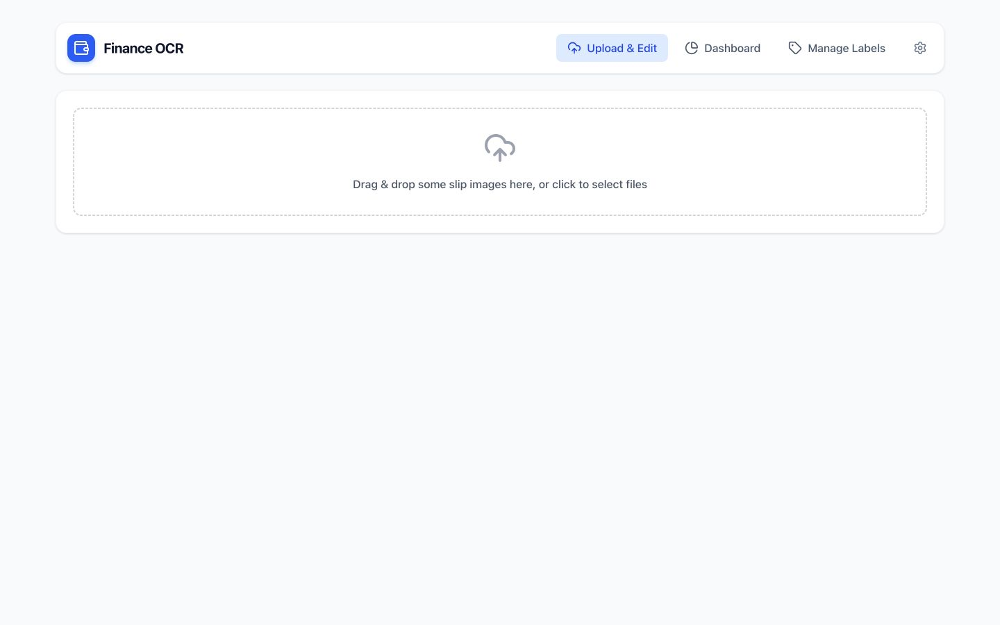
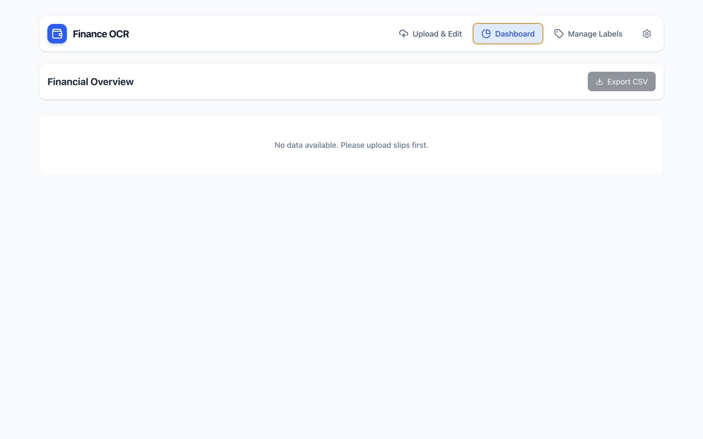
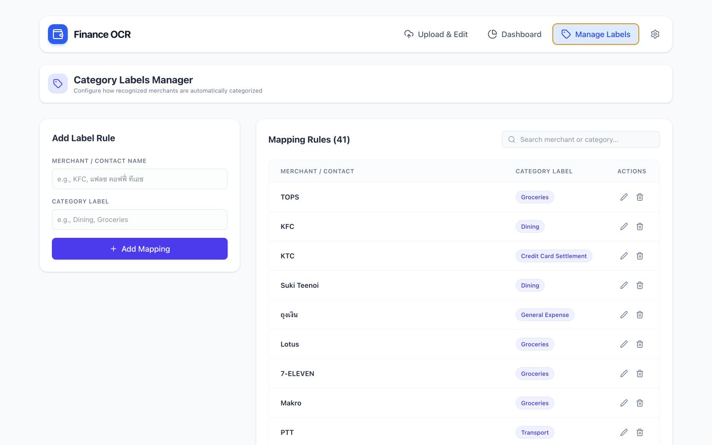
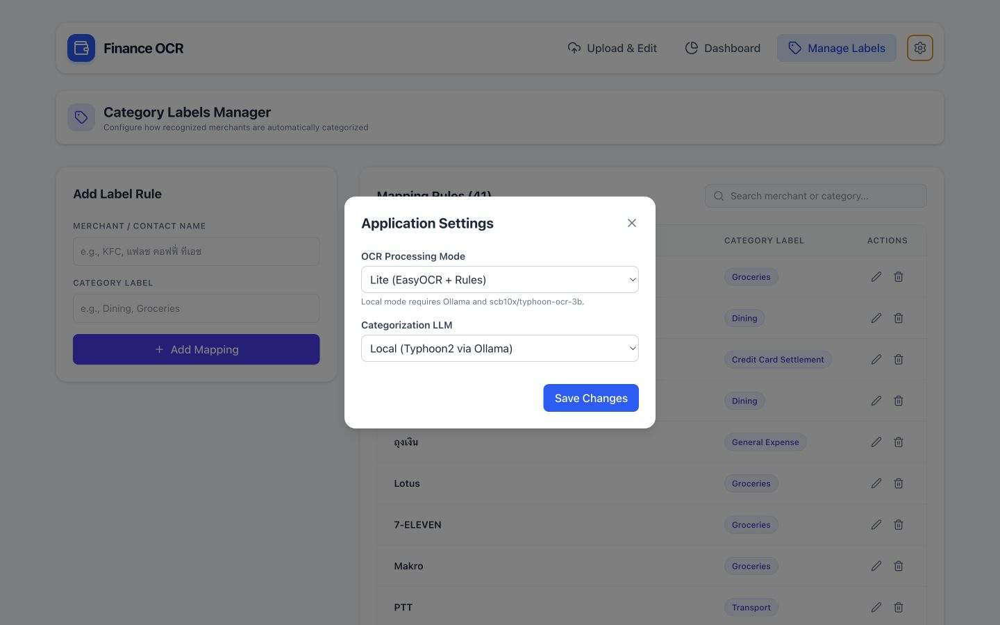
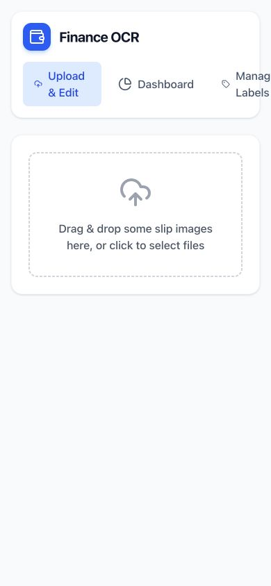
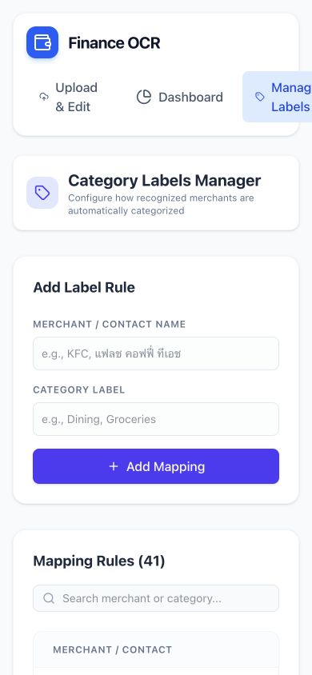

# Product Design & Feature Analysis

## Audit scope

This review covers the current React experience for uploading payment slips, reviewing spending, managing category rules, and changing OCR/LLM settings. It uses the running application at desktop (1440 × 900) and mobile (390 × 844), plus a focused review of the frontend and API behavior.

The target is a useful **personal finance tool**, not a production SaaS product. Recommendations favor local reliability and everyday convenience over accounts, cloud infrastructure, or enterprise controls.

## Overall verdict

The project has a strong, understandable foundation: three main areas, consistent cards and colors, a direct upload entry point, editable OCR results, and a useful rule manager. The highest-value next step is not a visual redesign. It is making the core loop—**upload → verify → correct → understand**—safer and more informative.

The most important gaps are mobile navigation overflow, weak review/error states after OCR, inconsistent spending calculations, and missing accessibility labels. The dashboard is visually ready but needs more useful personal-finance questions and stronger empty states.

## Flow review

### 1. Upload entry — Mostly healthy

**Strengths:** The upload area is immediately visible, has a large target, and keeps the first task focused.

**Improve:** Replace “some slip images” with specific guidance: accepted formats, whether multiple files are supported, and what happens next. Add a short title such as “Upload payment slips” and a privacy note such as “Images are processed locally and removed after extraction.” A small sample/preview would make the empty screen feel intentional rather than unfinished.

### 2. Empty dashboard — Needs improvement

The layout is clean, but the empty state is a dead end. Turn it into a helpful action: “Upload your first slips” linking back to Upload & Edit, plus one sentence explaining what the dashboard will show. Hide the disabled export action until data exists or explain why it is unavailable.

### 3. Category manager — Good foundation

The split layout, search, count, and inline actions work well. The main risk is data quality: category names are free text, so variants such as `Dining`, `Food`, and `dining` can fragment reporting. Use a canonical category selector with an explicit “Create category” path. Add confirmation or undo for deletion, and offer merge/rename when duplicate categories appear.

The current rules also include OCR-like noise. Flag suspicious rules such as blank/unknown receivers, punctuation-only names, or very low-quality text instead of learning them automatically.

### 4. Processing settings — Visually clear, behavior unclear

The two settings are understandable, but the UI does not show whether Ollama or a cloud provider is available. Add a small status indicator and a “Test configuration” action. Settings changed here only live for the current backend process, so either persist them locally or label them as session-only. For a personal project, an environment-file setup is also acceptable; avoid maintaining both unless the UI adds real convenience.

### 5. Mobile upload/navigation — Poor

At 390 px, navigation exceeds the viewport and the settings control is hidden. The page measured 474 px wide, confirming horizontal overflow. Use a compact mobile header with either a menu or a fixed bottom navigation. Keep labels short (`Upload`, `Insights`, `Rules`) and expose Settings in the menu.

### 6. Mobile category management — Usable content, broken frame

The form stacks well, but the clipped header and wide table make the experience fragile. Render mappings as cards on small screens—merchant, category chip, edit, delete—instead of forcing a desktop table into horizontal scrolling.

## Accessibility risks

- The settings icon, modal close button, and transaction debug button do not have accessible names.
- Several visible form labels are not programmatically associated with their inputs or selects.
- The settings overlay lacks clear dialog semantics, focus trapping, Escape-to-close behavior, and focus restoration.
- Small icon-only edit/delete controls are likely below a comfortable 44 × 44 px touch target.
- Charts rely heavily on color and hover tooltips; add text summaries or an accessible data table.
- Editable transaction cells need explicit labels, validation messages, and a visible saved/unsaved state.

These are implementation and screenshot-based risks, not a claim of WCAG compliance. Keyboard navigation, screen-reader output, zoom, and contrast should be tested separately.

## Prioritized improvements

| Priority | Improvement | Why it matters | Effort |
|---|---|---|---|
| P0 | Fix responsive navigation and mobile transaction/rule layouts | Removes the clearest broken experience | Small–medium |
| P0 | Add labels, dialog semantics, keyboard behavior, and larger icon targets | Makes existing features usable beyond pointer-only interaction | Small |
| P0 | Add review states for missing receiver, zero amount, unknown date, and uncategorized rows | Prevents bad OCR data from silently entering reports | Medium |
| P0 | Add per-row delete plus confirmation/undo for “Clear Data” and rule deletion | Avoids accidental loss | Small |
| P1 | Normalize dates and make all dashboard calculations exclude/include settlements consistently | Fixes misleading charts; daily totals currently differ from headline totals | Small |
| P1 | Replace “Avg per Category” with monthly change, transaction count, or uncategorized count | Answers more useful personal-finance questions | Small |
| P1 | Add date range/category filters and duplicate detection | Makes repeated use practical | Medium |
| P1 | Add local backup/restore (JSON or CSV import) | Protects local-only history without building accounts or cloud sync | Medium |
| P2 | Add image preview, rotate/crop, and OCR confidence details | Helps diagnose difficult slips | Medium–large |
| P2 | Validate slip QR data when available | Improves accuracy, but adds domain complexity | Large |

## Suggested feature direction

### Build next

1. **Review inbox:** After upload, separate “Ready” and “Needs attention” rows. Flag unknown receivers, invalid dates, zero amounts, duplicates, and low-confidence OCR.
2. **Useful monthly dashboard:** Add month/date filters, spending change from the previous period, uncategorized total, and top merchants. Keep the existing category and daily charts after date normalization.
3. **Safer local history:** Store a stable transaction ID, prevent duplicate uploads, allow individual deletion, and support backup/restore.
4. **Cleaner category learning:** Let “Remember this correction” create a rule intentionally; do not automatically save obviously noisy receiver text.

### Nice later

- Thai/English locale choice and consistent Thai date/currency formatting.
- Budget targets by category.
- Batch review shortcuts and bulk category editing.
- A small OCR/model health panel for local experimentation.

### Intentionally skip for now

Authentication, multi-user roles, cloud sync, payment integrations, audit logs, telemetry, and a large design-system rewrite would add maintenance without improving the personal workflow enough.

## Engineering observations affecting UX

- Frontend production build succeeds, although the main bundle is large.
- Frontend lint currently reports nine errors, mainly unused imports and one hook-related declaration issue.
- Transactions live in browser storage, while mappings live in `categories.json`; this split needs clear backup and reset behavior.
- Dates are stored as display strings and sorted lexically, which can produce an incorrect timeline.
- Credit card settlements are excluded from headline/category totals but included in daily spending, causing inconsistent reporting.

## Evidence limits

No sample payment-slip images were present, so the populated transaction table, chart states, OCR accuracy, upload timing, and recovery from real OCR failures were not visually exercised. The category and settings API states were available. A follow-up audit should use a small anonymized set of successful, failed, duplicate, and multi-transaction slips.
